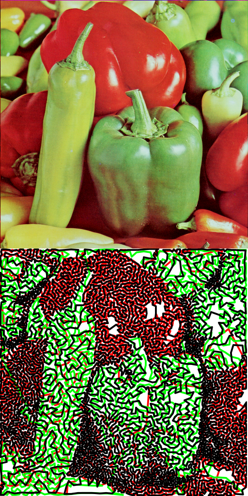

# raster2svg

[](https://github.com/sameer/raster2svg/actions/workflows/rust.yml)
[](https://codecov.io/gh/sameer/raster2svg)

Convert raster graphics into stylistic art renderings. The output of this program is intended for direct use with [svg2gcode](https://github.com/sameer/svg2gcode) to draw with a pen plotter.

## Demo

Using *4.2.07 Peppers* from the [SIPI image database](http://sipi.usc.edu/database/database.php?volume=misc&image=13#top):

```
cargo run --release  -- peppers.tiff -o peppers.svg --style tsp
```



## Pipeline

1. Image preprocessing
    * Derive key (black) using D50 illumination lightness (D65 sRGB to D50 CIELAB)
    * Derive colors by vector projection onto CIELAB or HSL hue + chroma
    * Square pixel values
1. Do Linde-Buzo-Gray stippling
    * Find Voronoi tesselation with Jump flooding algorithm (JFA)
    * Split stippling points along the cell's second-order moments when they cover too much capacity
    * Remove stippling points when they do not cover enough capacity
    * Calculate cell centroids and move points to them
    * Repeat until no splits/removes occur
1. Get Delaunay triangulation using [spade](https://github.com/Stoeoef/spade)
1. Find Euclidean MST with Prim's algorithm using edges from the Delaunay triangulation
1. Approximate an open-loop TSP path through the points
    * MST to TSP
    * Local Improvement with 4 operators: relocate, disentangle, 2-opt, and link swap
1. Draw to SVG


# References

Grouped by pipeline stage, all of the papers/pages below provided guidance in creating raster2svg.

Notice for lawyers: no papers are hosted here, they are all provided by the authors or from sci-hub.

## Preprocessing

* Color conversion matrices https://github.com/colour-science/colour/
* https://en.wikipedia.org/wiki/SRGB
* https://en.wikipedia.org/wiki/CIE_1931_color_space
* https://en.wikipedia.org/wiki/CIELAB_color_space
* From Stippling to Scribbling http://archive.bridgesmathart.org/2015/bridges2015-267.pdf
* On Spatial Quantization of Color Images https://www.researchgate.net/profile/Joachim-Buhmann/publication/220502178_On_spatial_quantization_of_color_images/links/00463516c3bf756dd3000000/On-spatial-quantization-of-color-images.pdf?origin=publication_detail

## Stippling

* Weighted Voronoi Stippling https://www.cs.ubc.ca/labs/imager/tr/2002/secord2002b/secord.2002b.pdf
* Weighted Linde-Buzo-Gray Stippling http://graphics.uni-konstanz.de/publikationen/Deussen2017LindeBuzoGray/WeightedLindeBuzoGrayStippling_authorversion.pdf
* Multi-Class Inverted Stippling https://kops.uni-konstanz.de/bitstream/handle/123456789/55976/Schulz_2-3pieljazuoer1.pdf?sequence=1&isAllowed=y
* Linking soft computing to art introduction of efficient k-continuous line drawing https://ieyjzhou.github.io/CIEG/Paper/KCLD_2018_Published_Version.pdf
* Andrew's monotone chain convex hull algorithm https://en.wikibooks.org/wiki/Algorithm_Implementation/Geometry/Convex_hull/Monotone_chain
* Beyond Stippling -- Methods for Distributing Objects on the Plane: http://kops.uni-konstanz.de/bitstream/handle/123456789/6219/Beyond_Stippling_Methods_for_Distributing_Objects_on_the_Plane_2003.pdf?sequence=1&isAllowed=y

### Voronoi Diagram

* Jump Flooding in GPU with Applications to Voronoi Diagram and Distance Transform https://www.comp.nus.edu.sg/~tants/jfa/i3d06.pdf

## MST

* Algorithms for computing Euclidean MSTs in two dimensions https://en.wikipedia.org/wiki/Euclidean_minimum_spanning_tree#Algorithms_for_computing_EMSTs_in_two_dimensions

## TSP

* Converting MST to TSP Path by Branch Elimination http://cs.uef.fi/sipu/pub/applsci-11-00177.pdf
* Which Local Search Operator Works Best for the Open-Loop TSP? https://www.mdpi.com/2076-3417/9/19/3985/pdf
* TSP Art https://archive.bridgesmathart.org/2005/bridges2005-301.pdf

## Edges + Hatching

* Flow-Based Image Abstraction http://www.cs.umsl.edu/~kang/Papers/kang_tvcg09.pdf
* Coherent Line Drawing http://umsl.edu/cmpsci/about/People/Faculty/HenryKang/coon.pdf

## Honorable mentions

There are also some noteworthy papers that while interesting did not directly influence raster2svg (yet!).

* Amplitude Modulated Line-Based Halftoning http://graphics.uni-konstanz.de/publikationen/Ahmed2016AmplitudeModulatedLine/paper.pdf
* Structure grid for directional stippling http://www.cs.umsl.edu/~kang/Papers/kang_gm2011.pdf
* Halftoning and Stippling http://graphics.uni-konstanz.de/publikationen/Deussen2013HalftoningStippling/Deussen2013HalftoningStippling.pdf
* Capacity-constrained point distributions https://sci-hub.st/https://doi.org/10.1145/1576246.1531392
* Fast Capacity Constrained Voronoi Tessellation https://www.microsoft.com/en-us/research/wp-content/uploads/2009/10/paper-1.pdf
* Continuous-Line-Based Halftoning with Pinwheel Tiles http://abdallagafar.com/abdalla/wp-content/uploads/2020/11/Continuous-Line-Based-Halftoning-with-Pinwheel-Tiles.pdf
* Tone- and Feature-Aware Circular Scribble Art https://sci-hub.st/10.1111/cgf.12761
* A comprehensive survey on non-photorealistic rendering and benchmark developments for image abstraction and stylization https://sci-hub.st/https://doi.org/10.1007/S42044-019-00034-1
* Opt Art: Special Cases https://archive.bridgesmathart.org/2011/bridges2011-249.pdf
* Edge-Constrained Tile Mosaics http://archive.bridgesmathart.org/2007/bridges2007-351.pdf
* Modular line-based halftoning via recursive division https://sci-hub.st/10.1145/2630397.2630403
* Hilbert halftone art: https://possiblywrong.wordpress.com/2017/12/26/hilbert-halftone-art/
* Abstracting images into continuous-line artistic styles https://sci-hub.st/https://doi.org/10.1007/s00371-013-0809-1
* A Graph‐based Approach to Continuous Line Illustrations with Variable Levels of Detail https://www.u-aizu.ac.jp/~shigeo/pdf/pg2011c-preprint.pdf
* Depth-aware coherent line drawings https://kops.uni-konstanz.de/bitstream/123456789/32742/1/Spicker_0-307233.pdf
* Hamiltonian cycle art: Surface covering wire sculptures and duotone surfaces http://people.tamu.edu/~ergun/research/topology/papers/candg12.pdf
* Generating Color Scribble Images using Multi‐layered Monochromatic Strokes Dithering http://cgv.cs.nthu.edu.tw/~seanyhl/project/ColorScribbleArt/MLMSD_eg19.pdf
* LinesLab: A Flexible Low\u2010Cost Approach for the Generation of Physical Monochrome Art https://vis.uib.no/wp-content/papercite-data/pdfs/Stoppel-2019-LFL.pdf
* State of the "Art": A Taxonomy of Artistic Stylization Techniques for Images and Video http://epubs.surrey.ac.uk/721461/1/Collomosse-TVCG-2012.pdf
* XDoG: Advanced Image Stylization with eXtended Difference-of-Gaussians https://sci-hub.st/10.1145/2024676.2024700
* Colored Pencil Filter with Custom Colors https://sci-hub.st/https://doi.org/10.1109/PCCGA.2004.1348364
* PencilArt: A Chromatic Penciling Style Generation Framework https://sci-hub.st/https://doi.org/10.1111/cgf.13334
* A Texture-Based Approach for Hatching Color Photographs https://sci-hub.st/https://doi.org/10.1007/978-3-642-17289-2_9
* Perception-Motivated High-Quality Stylization https://curve.carleton.ca/system/files/etd/e1a12c4d-890e-4626-8f57-768f661f3121/etd_pdf/10e988374e6e4a31b58b17568881b47f/li-perceptionmotivatedhighqualitystylization.pdf
* Abstract line drawings from photographs using flow-based filters https://sci-hub.st/https://doi.org/10.1016/j.cag.2012.02.011
* LSD: a Line Segment Detector https://api.semanticscholar.org/CorpusID:5847178
* The Multiscale Line Segment Detector https://hal-enpc.archives-ouvertes.fr/hal-01571615/file/workshop_mlsd.pdf
* An extended flow-based difference-of-Gaussians method of line drawing for polyhedral image https://sci-hub.st/https://doi.org/10.1016/J.IJLEO.2014.05.031
* Edge Drawing: A combined real-time edge and segment detector http://c-viz.eskisehir.edu.tr/pdfs/ED.pdf
* A Parameterless Line Segment and Elliptical Arc Detector with Enhanced Ellipse Fitting https://sci-hub.st/https://doi.org/10.1007/978-3-642-33709-3_41
* EDLines: A real-time line segment detector with a false detection control https://sci-hub.st/https://doi.org/10.1016/j.patrec.2011.06.001
* EDCircles: A real-time circle detector with a false detection control https://sci-hub.st/https://doi.org/10.1016/j.patcog.2012.09.020